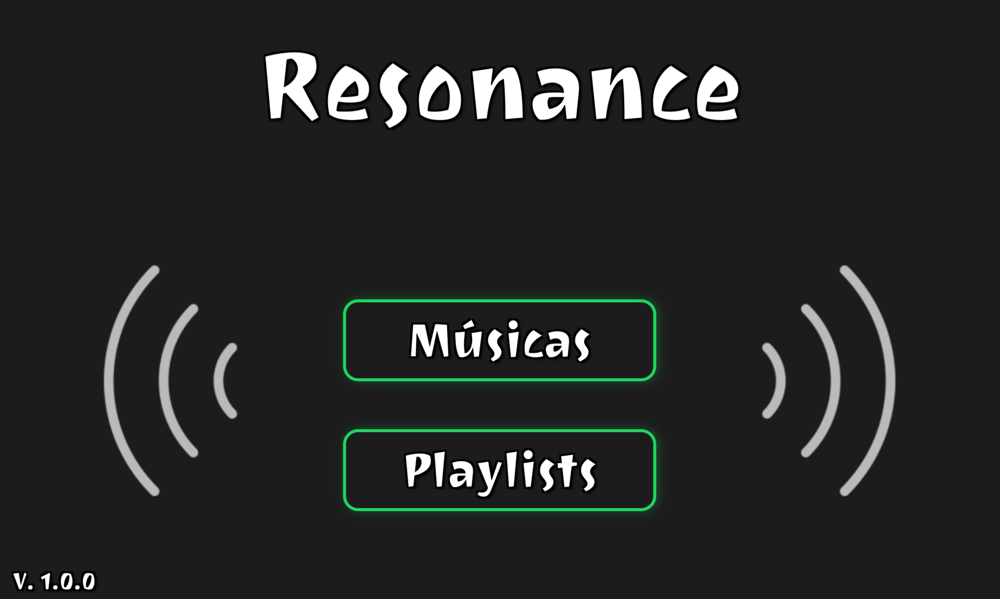
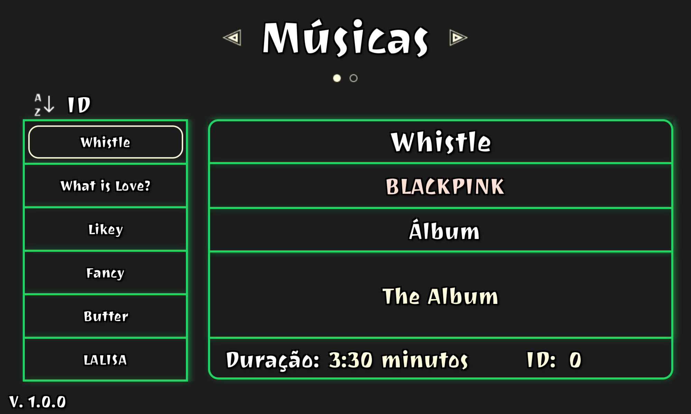
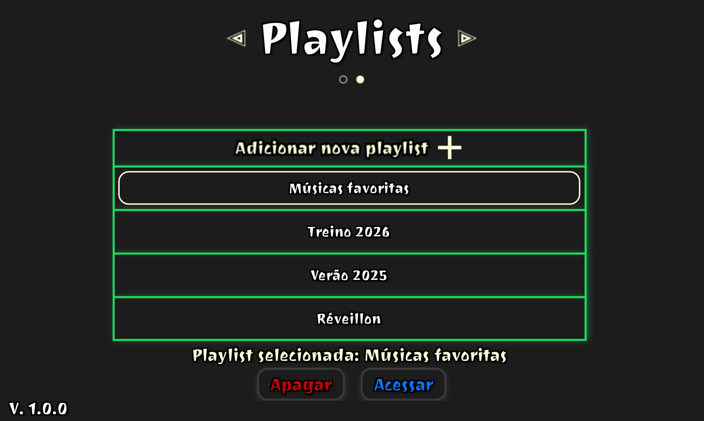
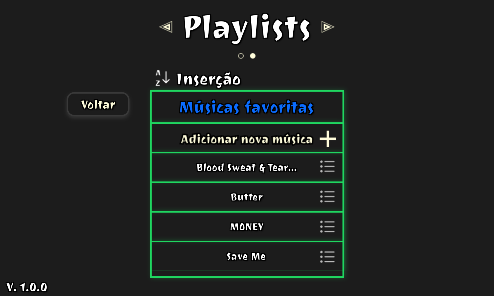

# Resonance

Catálogo musical para desktop escrito em C com GTK 3: navegue por 98 músicas e organize playlists salvas em arquivos binários.



## O problema

Trabalho final da disciplina de Programação II (UFRJ, 2024). O enunciado pedia um catálogo de músicas com playlists persistidas em arquivo, em que a ordem das músicas de uma playlist pudesse ser alterada: por inclusão, por nome, por artista ou por duração.

Projeto acadêmico desenvolvido em grupo de cinco integrantes. Em 2026 revisei o código para publicação (ver [Revisão de 2026](#revisão-de-2026)).

## Minhas contribuições

- Escrevi a aplicação gráfica entregue: layout da interface no Glade, estilos em CSS, imagens próprias da interface e todo o código C (interface e camada de arquivos).
- Montei a base de 98 músicas e o instalador para Windows.
- Uma versão para terminal, baseada em lista encadeada, não era compatível com a interface e não foi usada; ela foi removida do código na revisão de 2026 e continua no histórico do Git.

## Funcionalidades

- Lista das 98 músicas com título, artista, álbum, duração e ID.
- Ordenação da lista por ID, duração, título, artista ou álbum.
- Criação, abertura e exclusão de playlists. Nomes aceitam acentos (ex.: "Músicas favoritas") e são comparados sem diferenciar maiúsculas.
- Inclusão e remoção de músicas em uma playlist, sem duplicatas.
- Ordenação das músicas da playlist, incluindo a ordem de inclusão.
- Tudo é salvo em arquivos e continua disponível na próxima execução.

O Resonance organiza o catálogo; ele não reproduz áudio.

| Lista de músicas | Playlists | Playlist aberta |
|---|---|---|
|  |  |  |

## Arquitetura

```
 assets/ui_files/playlists.glade ──┐
 assets/css/style.css ─────────────┤
                                   ▼
                          src/main.c  (interface GTK 3)
                                   │
                                   ▼
                          src/library.c (músicas, playlists, ordenação)
                                   │
          ┌────────────────────────┼─────────────────────────┐
          ▼                        ▼                         ▼
 files/musics_database.bin  files/playlists/          files/playlists/
 (98 registros Song)        playlist_registry.bin     playlist_<id>.bin
                            (registros Playlist)      (registros Song)
          ▲
          │ make database
 tools/build_database.c ◄── data/musics.txt
```

- **`src/main.c`**: carrega a interface do arquivo Glade, aplica o CSS e cria em tempo de execução os botões de cada item das listas.
- **`src/library.c`**: toda a leitura e escrita de arquivos, a validação de nomes de playlist e a ordenação. Não depende do GTK, só da GLib (UTF-8).
- **`tools/build_database.c`**: programa separado que gera a base binária a partir de `data/musics.txt` (4 linhas por música: título, álbum, artista, duração `m:ss`).

## Decisões técnicas

**Registros binários de tamanho fixo.** Cada música ocupa 808 bytes (`struct Song`) e cada playlist, 104 bytes (`struct Playlist`). O item *n* fica no byte `n × tamanho`, então contar itens é dividir o tamanho do arquivo e ler um item é um `fseek`. O custo: a maior parte do espaço é preenchimento (a base de 98 músicas tem 79 KB), e o formato depende da ordem dos campos da struct — mudar a struct invalida os arquivos existentes.

**Arquivo da playlist nomeado pelo ID, não pelo nome.** O nome digitado nunca entra no caminho do arquivo (`playlist_<id>.bin`), o que elimina *path traversal* por construção. O custo é um arquivo de registro que associa ID e nome.

**Validação de nome por lista de permissão.** O nome é normalizado (NFC), aparado e aceito só se tiver de 1 a 18 caracteres entre letras e números de qualquer idioma e espaços. A comparação de duplicatas usa *case folding*, então "Rock" e "rock" são a mesma playlist.

**Remoção reescrevendo o arquivo.** Para remover uma música ou playlist, o arquivo é lido para a memória, truncado e regravado sem o item. Mantém a ordem de inclusão com pouco código; o custo é O(n) por remoção e a operação não é atômica (ver limitações).

**Ordenação com `qsort` e desempate por ID.** Cada critério é um comparador; empates são decididos pelo ID, para a ordem ser sempre a mesma. Textos são comparados com `g_utf8_collate`, que respeita acentos e o idioma do sistema.

**Base gerada por ferramenta.** A base binária é um artefato gerado a partir de um arquivo de texto versionado. A ferramenta valida tudo antes de gravar e zera os bytes não usados, então a mesma entrada produz sempre o mesmo arquivo.

## Estrutura de pastas

```
resonance/
├── assets/
│   ├── css/style.css
│   ├── fonts/            # Joti One + licença OFL
│   ├── ui_files/         # interface (Glade)
│   └── ui_images/
├── data/musics.txt       # fonte da base de músicas
├── docs/screenshots/
├── files/
│   ├── musics_database.bin
│   └── playlists/        # criada vazia; preenchida em tempo de execução
├── src/
│   ├── main.c
│   ├── library.c
│   └── library.h
├── tools/build_database.c
├── Makefile
├── CREDITS.md
└── LICENSE
```

## Como executar

### Windows

Baixe o instalador na seção [Releases](../../releases). Ele instala o programa, as bibliotecas do GTK e a fonte, sem exigir permissão de administrador.

### Linux (compilando)

Testado no Ubuntu.

```bash
sudo apt install build-essential pkg-config libgtk-3-dev

# fonte usada pela interface
mkdir -p ~/.local/share/fonts
cp assets/fonts/JotiOne-Regular.ttf ~/.local/share/fonts/
fc-cache -f

make run
```

Outros alvos do Makefile:

```bash
make            # só compila (bin/resonance)
make database   # regera files/musics_database.bin a partir de data/musics.txt
make clean
```

O programa usa caminhos relativos a `bin/` (`../assets`, `../files`); `make run` já executa a partir dessa pasta.

## Limitações conhecidas

- Precisa ser executado a partir de `bin/`. Fora dela, encerra com uma mensagem de erro.
- Janela de tamanho fixo (1000 × 600): os elementos são posicionados em coordenadas absolutas.
- A base de músicas é fixa; não há como adicionar músicas pela interface (só editando `data/musics.txt` e rodando `make database`).
- Remoções não são atômicas: se o programa for interrompido no meio da regravação, o arquivo da playlist pode perder itens.
- Os arquivos binários guardam inteiros na ordem de bytes da máquina; são compatíveis entre Linux e Windows em x86-64, mas não entre arquiteturas com *endianness* diferente.
- Interface apenas em português.

## Revisão de 2026

Principais mudanças em relação à versão entregue em 2024:

- Correção de falhas de memória: `fclose` em ponteiro não inicializado, funções sem `return`, estouros de buffer com nomes acentuados, estouro do vetor de botões com mais de quatro playlists, `fclose` duplicado e vazamentos.
- Porte para Linux (inclusão exclusiva do Windows e caminhos com barra invertida).
- Suporte a nomes de playlist com acento e arquivos de playlist nomeados por ID.
- Remoção do código não utilizado, identificadores e comentários em inglês, código em `src/`, `Makefile` e ferramenta de geração da base.
- Remoção de 185 MB de binários (DLLs e executáveis) do histórico do Git.

## Tecnologias

C, GTK 3, GLib, Glade, CSS, Make, Inno Setup.

## Licença

Código sob a licença MIT — ver [LICENSE](LICENSE). A fonte Joti One é distribuída sob a SIL Open Font License 1.1 e os ícones de terceiros estão creditados em [CREDITS.md](CREDITS.md).
